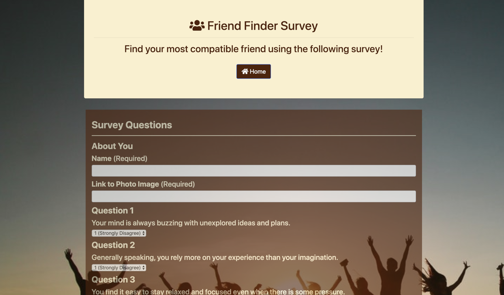

# Friend Finder - Node and Express Servers

### Overview

This is a compatibility-based "FriendFinder" application -- basically a dating app. This full-stack site will take in results from users' surveys, then compare their answers with those from other users. The app will then display the name and picture of the user with the best overall match.

Using Express to handle routing. The app was deployed to Heroku so other users can fill it out.

- Directories map:

  ```
  FriendFinder
    - .gitignore
    - app
      - data
        - friends.js
      - public
        - home.html
        - survey.html
      - routing
        - apiRoutes.js
        - htmlRoutes.js
    - node_modules
    - package.json
    - server.js
  ```

### Instructions

1. The survey should has 10 questions. Each answer is on a scale of 1 to 5 based on how much the user agrees or disagrees with a question.

2. The app determines the user's most compatible friend using the following as a guide:

   - Compare the difference between current user's scores against those from other users, question by question. Adding up the differences to calculate the `totalDifference`.
     - Example:
       - User 1: `[5, 1, 4, 4, 5, 1, 2, 5, 4, 1]`
       - User 2: `[3, 2, 6, 4, 5, 1, 2, 5, 4, 1]`
       - Total Difference: **2 + 1 + 2 =** **_5_**
   - The closest match will be the user with the least amount of difference.

3. Once found the current user's most compatible friend, the result is displayed as a modal pop-up.

### Hosting on Heroku

The app was deployed on Heroku for hosting at the following address:
https://nameless-anchorage-55800.herokuapp.com/home





